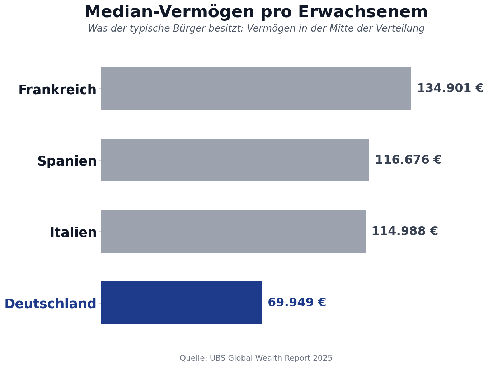

Deutschland ist die drittgrößte Volkswirtschaft der Welt. Knapp fünf Billionen Dollar Wirtschaftsleistung pro Jahr. Ein Land, das in jeder internationalen Statistik unter den Schwergewichten auftaucht. Und doch zeigt eine Zahl, dass dieser Wohlstand am typischen Bürger vorbeigeht: Beim Median-Vermögen pro Erwachsenem liegt Deutschland in Europa auf Platz 17.

Frankreich, Italien und Spanien stehen alle deutlich besser da. Der typische Spanier besitzt fast doppelt so viel Vermögen wie der typische Deutsche. Wie passt das zusammen?

## Die Zahlen

Der UBS Global Wealth Report 2025 misst das Vermögen pro Erwachsenem in einer großen Zahl von Ländern, sowohl als Mittelwert als auch als Median. Der Mittelwert ergibt sich, wenn man das gesamte Vermögen durch die Zahl der Erwachsenen teilt. Der Median ist der Wert, der genau in der Mitte der Verteilung liegt: Die eine Hälfte der Bevölkerung hat mehr, die andere Hälfte hat weniger.

Beim Median-Vermögen pro Erwachsenem zeigt sich folgendes Bild:

| Land | Median-Vermögen pro Erwachsenem |
|------|---------------------------------|
| Frankreich | 134.901 € |
| Spanien | 116.676 € |
| Italien | 114.988 € |
| Deutschland | 69.949 € |

Beim Mittelwert sieht es anders aus. Da liegt Deutschland mit 237.172 Euro pro Erwachsenem im EU-Mittelfeld auf Platz 11. Der Wert kommt zustande, weil das gesamte Privatvermögen Deutschlands rechnerisch hoch ist. Sobald man aber den Median betrachtet, fällt das Land auf Platz 17 zurück.

Die Lücke zwischen Mittelwert und Median ist der entscheidende Hinweis. Sie sagt: Es gibt zwar viel Vermögen in Deutschland, aber es ist sehr ungleich verteilt. Wenige besitzen viel, viele besitzen wenig. Der Mittelwert wird durch die Vermögen oben nach oben gezogen, der Median bleibt unberührt davon.

## Median und Mittelwert: Warum die Unterscheidung wichtig ist

Wer den durchschnittlichen Wohlstand eines Landes verstehen will, muss wissen, mit welcher Kennzahl er es zu tun hat.

Der **Mittelwert** ist eine Rechengröße. Er beantwortet die Frage: Wie viel käme heraus, wenn man das gesamte Vermögen gleichmäßig auf alle verteilen würde? In Ländern mit hoher Vermögenskonzentration ist der Mittelwert deshalb fast immer deutlich höher als der Median.

Der **Median** ist eine Aussage über den typischen Bürger. Er sagt: So viel Vermögen hat genau die Person, die in der Mitte der Verteilung steht. Fünfzig Prozent haben mehr, fünfzig Prozent haben weniger.

Wenn ein Land beim Mittelwert hoch und beim Median niedrig liegt, ist das ein klares Zeichen für Konzentration. Genau das ist die deutsche Situation. Im internationalen Vergleich fällt Deutschland zwischen den beiden Kennzahlen um sechs Plätze. Diese Lücke ist nirgendwo in Europa größer.

## Häufige Einwände und was die Daten dazu sagen

Die Median-Zahl wirft Fragen auf. In Diskussionen kommen regelmäßig dieselben Einwände. Sie sind ernst zu nehmen, weil sie auf realen Faktoren beruhen. Sie erklären aber nicht alles.

### Einwand 1: Die niedrige Wohneigentumsquote

Deutschland hat mit rund 47 Prozent die niedrigste Wohneigentumsquote in der Europäischen Union. In Spanien liegt sie bei über 80 Prozent, in Italien bei knapp 70 Prozent, in Frankreich bei 55 Prozent. Selbstgenutztes Wohneigentum ist in den meisten Haushalten der größte Vermögensposten. Wer mietet, baut diesen Posten gar nicht erst auf.

Das stimmt und erklärt einen erheblichen Teil der Lücke. Allerdings ist die niedrige Wohneigentumsquote selbst kein Naturgesetz. Sie ist das Ergebnis politischer Weichenstellungen über Jahrzehnte: Bau- und Mietrecht, steuerliche Förderung, Zinspolitik, Bodenrecht. Andere Länder haben das anders aufgestellt und haben deshalb andere Quoten. Wer die niedrige Wohneigentumsquote als Erklärung anführt, beantwortet damit nicht die Frage, sondern verschiebt sie: Warum wurde Wohneigentum in Deutschland politisch nicht so gefördert wie anderswo?

### Einwand 2: Rentenansprüche werden nicht mitgezählt

Die UBS-Statistik und die meisten internationalen Vermögensvergleiche erfassen nur privates Geld- und Sachvermögen. Anwartschaften aus der gesetzlichen Rentenversicherung tauchen darin nicht auf. Ein deutscher Durchschnittsrentner hat aber Rentenansprüche im rechnerischen Wert von mehreren hunderttausend Euro. Würde man diese sogenannte Augmented Wealth einbeziehen, sähe Deutschland im Vergleich besser aus.

Auch das stimmt teilweise. Wirtschaftswissenschaftliche Berechnungen zeigen, dass die Lücke kleiner wird, wenn man Rentenansprüche einrechnet. Sie verschwindet aber nicht. Außerdem hat eine Rentenanwartschaft Eigenschaften, die ein Eigenheim nicht hat. Sie ist nicht vererbbar, nicht beleihbar, nicht investierbar. Sie kann auch nicht abgesehen vom Rentenbezug verfügbar gemacht werden. Wenn das Pflegeheim 3.245 Euro im Monat kostet und die Rente 950 Euro beträgt, hilft die rechnerische Anwartschaft nicht weiter. Der italienische Rentner mit dem abbezahlten Haus hat dann etwas Konkretes, was ihn schützt.

Außerdem ändert die Augmented-Wealth-Methode nichts an der innerdeutschen Verteilung. Wer in Deutschland zur unteren Hälfte gehört, hat auch bei den Rentenanwartschaften keine großen Sprünge.

### Einwand 3: Die Steuer- und Abgabenquote ist in Deutschland hoch

Ein verbreitetes Argument lautet: Den Deutschen bleibt einfach weniger zum Leben übrig, weil der Staat zu viel abnimmt. Ein Blick auf die Daten widerlegt das.

Die gesamte Steuer- und Abgabenquote, also alles was an Staat und Sozialversicherung geht, im Verhältnis zur Wirtschaftsleistung, lag 2023 laut Bundesfinanzministerium bei folgenden Werten:

- Frankreich: 43,8 Prozent
- Italien: 42,8 Prozent
- Deutschland: 38,1 Prozent
- Spanien: rund 36,7 Prozent

Frankreich und Italien holen ihren Bürgern also mehr aus der Tasche als Deutschland, nicht weniger. Trotzdem haben deren Bürger im Median mehr Vermögen.

Anders sieht es beim Steuer- und Abgabenkeil auf Arbeit aus. Bei einem alleinstehenden Durchschnittsverdiener ohne Kinder lag dieser Wert in Deutschland 2024 bei 47,9 Prozent, in Frankreich bei 47,2 Prozent, in Italien bei 47,1 Prozent. Praktisch gleichauf. Bei einem verheirateten Alleinverdiener mit zwei Kindern dreht sich das Bild: Deutschland liegt bei 33,3 Prozent, Frankreich mit 39,1 Prozent an der Spitze der OECD.

Egal welche Methode man anwendet: Die Hypothese, dass Deutschland besonders belastet sei und deshalb weniger Vermögen aufgebaut werde, hält den Daten nicht stand.

### Einwand 4: Die Anlagementalität ist anders

Deutsche legen ihr Geld traditionell auf das Sparbuch, andere Länder investieren in Aktien und Immobilien. Das stimmt empirisch. Die Aktienquote der privaten Haushalte ist in Deutschland niedrig, in Frankreich, Schweden oder den Niederlanden deutlich höher. Wer 1990 in den Dax investiert hat, hat heute ein Vielfaches dessen, was auf einem Sparbuch übrig wäre.

Auch dieser Punkt erklärt einen Teil der Lücke. Aber auch er ist nicht naturgegeben. Die deutsche Sparkultur ist Ergebnis von Erfahrungen mit zwei Inflationen, von Bildungspolitik, von steuerlichen Anreizen und von Vertriebsstrukturen im Finanzsystem. Andere Länder haben ihre Bürger früher und systematischer an Kapitalmärkte herangeführt. Es ist eine politische Frage, ob man das ändern will.

### Einwand 5: Der Ost-West-Effekt

Die deutsche Wiedervereinigung wirkt bis heute statistisch nach. In Ostdeutschland liegt das Median-Vermögen deutlich unter dem westdeutschen Wert. Vier Jahrzehnte DDR bedeuteten kaum privater Vermögensaufbau, keine Erbschaften, keine Immobilienbestände. Auch im Westen wurde 1945 bei null begonnen, aber die Bedingungen für Vermögensaufbau waren nach Kriegsende deutlich besser.

Auch dieser Effekt ist real. Er erklärt einen Teil des niedrigen Bundes-Medians. Aber er erklärt nicht, warum der Westen allein im europäischen Vergleich nicht weiter vorne liegt. Und er ändert nichts an der hohen innerdeutschen Konzentration, die in Ost wie West besteht.

## Was bleibt

Wenn man alle diese Einwände sauber abzieht, bleibt eine Erkenntnis stehen: Deutschland ist als Land reich. Der typische Deutsche ist es nicht. Die Lücke zwischen dem rechnerischen Wohlstand des Landes und dem tatsächlichen Wohlstand der mittleren Bevölkerung ist auffällig groß und größer als in vergleichbaren europäischen Ländern.

Damit stellt sich die nächste Frage: Wenn das Vermögen in Deutschland nicht in der Mitte liegt, wo liegt es dann? Wie ist es innerhalb des Landes verteilt? Diese Frage steht im Mittelpunkt des nächsten Beitrags.

## Quellen

- UBS Global Wealth Report 2025: <https://www.ubs.com/global/en/wealthmanagement/insights/global-wealth-report.html>
- Bundeswirtschaftsministerium: Vermögensungleichheit in Deutschland und Europa (Schlaglichter der Wirtschaftspolitik, März 2024): <https://www.bundeswirtschaftsministerium.de/Redaktion/DE/Schlaglichter-der-Wirtschaftspolitik/2024/03/05-vermoegensungleichheit-in-deutschland-und-europa.html>
- Deutsche Bundesbank: Distributional Wealth Accounts: <https://www.bundesbank.de/de/presse/pressenotizen/bundesbank-veroeffentlicht-verteilungsbasierte-vermoegensbilanz-der-privaten-haushalte-in-deutschland-921296>
- Bundesfinanzministerium: Monatsbericht August 2025, Steuer- und Abgabenquoten im internationalen Vergleich
- OECD: Taxing Wages 2025, Country Note Germany
